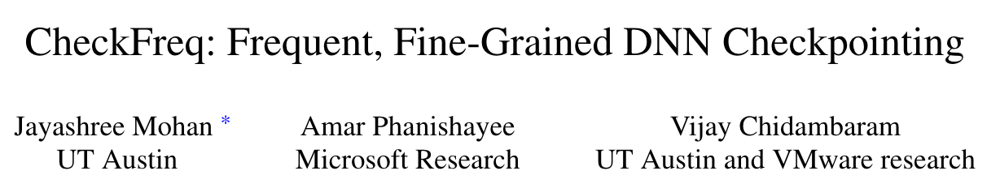
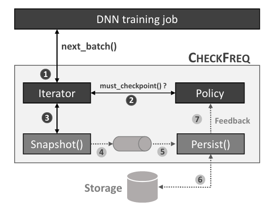
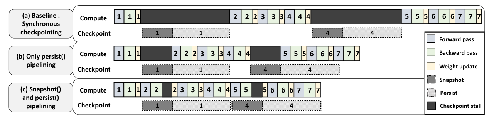

# CheckFreq: Frequent, Fine-Grained DNN Checkpointing

!!! abstract
    

    * Paper: [CheckFreq: Frequent, Fine-Grained DNN Checkpointing](https://www.usenix.org/system/files/fast21-mohan.pdf)

    * **FAST'21**

!!! warning
    读到一半感觉这个异步的设计太初步了（毕竟是很早的论文），后边的内容并没有仔细阅读。暂时搁置。

## 介绍

### 摘要

这是一篇比较老的训练优化论文，主要内容是设计了两阶段检查点来将计算和 IO 进行重叠，以减少检查点带来的运算暂停与性能损失。

检查点是将显存中的参数与优化器状态写到持久存储中，减少系统故障带来影响的技术。传统的检查点技术会在特定的 epoch（即所有训练数据均参与一次）后**暂停**训练，并将显存中的状态写入到持久存储中。**CheckFreq** 是一个自动配置的、细粒度的检查点技术，它可以：

1. 通过算法自动决定写检查点的频率。
2. 在运行时动态调整检查点频率以控制检查点带来的额外开销。
3. 保证每轮使用的训练数据一致。
4. 设计了两阶段流水的检查点技术，将运算与 IO 进行一定程度的重叠，降低检查点带来的额外开销。

实验证明在不同的模型及实验平台上可以将复原时间从“小时”降低到“秒”，同时检查点带来的运行时开销在 3.5% 以内。

### 引言与背景

DNN 训练通常耗时很久，因此模型参数以及优化器状态等通常需要隔一段时间写入到持久存储中以减少系统崩溃时的恢复代价，这样的技术被称为**检查点(checkpointing)**，传统的检查点技术发生在某次 epoch 后。在训练过程中时常发生系统故障，有工作表明训练任务的故障间平均时长(mean time between failure, MTBF)为 4-22 小时。随着训练数据和模型复杂度提高，每一 epoch 的间隔时间越来越长，这也导致检查点间隔时间更长，系统崩溃时需要的时间更长。

CheckFreq 希望通过迭代(iteration)粒度的检查点来减少系统崩溃时的恢复代价。需要解决的问题与 CheckFreq 的设计简述如下：

1. 如何确定写检查点的**频率**。合适的写检查点频率与模型、训练平台（如存储带宽）有关，并非一成不变的。CheckFreq 在运行时通过获取任务的特征来确定一个初始的写频率(systematic online profiling)，同时根据环境影响动态调整写检查点的间隔时间(adaptive rate runing)。

2. 写检查点时的训练**暂停**。因为每个训练迭代中都会有状态改变，因此训练需要在写检查点时暂停，来保证将现在的状态写到持久存储中，暂停过程中 GPU 没有进行下一轮运算，如果简单的提高写检查点的频率会极大影响训练效率。CheckFreq 为 DNN 训练设计了两阶段的检查点策略，即**快照(snapshot)与持久化(persist)**两阶段。快照阶段中 CheckFreq 流水地在内存中拷贝所有参数；持久化阶段将快照阶段获得的拷贝异步写入到持久存储中。

3. 每轮使用的训练数据保持一致。每个 epoch 都应该将所有训练数据以随机顺序处理正好一次。若以 iteration 为单位写检查点，需要在恢复时保证训练不会使用这一 epoch 已处理的数据。

## 设计与实现

CheckFreq 的目标是保证检查点正确性（一致且被持久化），自动进行写检查点频率设置，降低写检查点的时间成本，尽可能少的代码修改。

整体设计如下图，主要构成是可恢复的数据迭代器（向训练任务返回 minibatch 的数据），接收反馈的协议判断（决定是否触发一次写检查点）以及两阶段的写检查点机制（快照与持久化）。

CheckFreq 的最大特征是**对存储的异步写**，实现的途径是在快照阶段先将 GPU 中的模型状态拷贝到 CPU memory 中。关注到仅有在参数更新阶段才会改变模型状态，因此可以将数据搬运与下一轮 GPU 运算进行重叠，减少写检查点带来的 stall 时间。文中提到 GPU 到 CPU 的数据传输可能成为关键路径（耗时较长），可以使用显存来暂时放置，在持久化阶段再异步地先搬运到 CPU 再写入硬盘。

