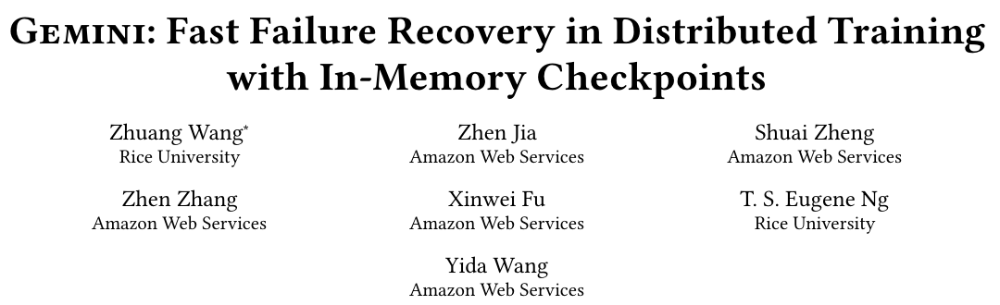
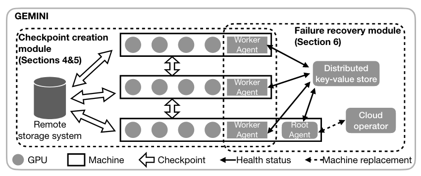
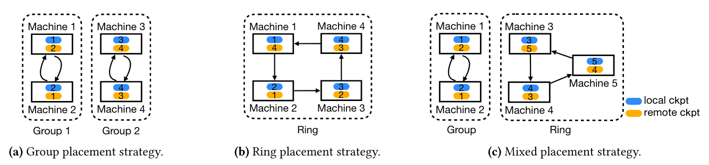

# Gemini: Fast Failure Recovery in Distributed Training with In-Memory Checkpoints

!!! abstract
    

    * Paper: [Gemini: Fast Failure Recovery in Distributed Training with In-Memory Checkpoints](https://dl.acm.org/doi/10.1145/3600006.3613145)

    * **SOSP'23**

## 介绍

### 摘要

Gemini 是一个大模型的分布式训练系统，可以做到故障后的快速恢复。Gemini 的设计特征是向 CPU memory 写检查点并具有更大的聚合带宽。Gemini 通过接近最优的检查点放置策略，最大化从 CPU memory 检查点恢复（而不是从远程存储拉取）的可能性；通过通讯规划算法，最小化甚至消除写检查点对训练性能的影响。实验表明 Gemini 在恢复时相对于现有的解决方案达到了至少 13 倍的速度提升。

### 引言

当前模型参数量不断提升，由于使用了更多数量的加速器（如以万计的 GPU），在训练大模型时遇到系统故障的频率以及训练所用的时间均有所提升。现有的方案向远程存储系统写检查点，使得恢复过程被存储系统和网络带宽限制；同时为了保证模型质量，现有方案不能通过丢弃故障机器的运算结果来快速恢复训练过程。

* Gemini 利用 CPU memory 的高带宽来达到即时检查点复原以及更高的检查点频率（理想情况下每一轮训练都写检查点），进而实现了更快的故障恢复。
* Gemini 利用多层存储（本地 CPU memory，远程 CPU memory 以及远程持久存储）来保存检查点文件。
* Gemini 利用优化的集群网络连接来进行写检查点，以此达到了更快的写检查点频率。
* Gemini 保证了 100% 的故障恢复并永远从最快的存储位置获取检查点信息，以最小化恢复的时间代价。

向 CPU memory 写检查点需要解决两个问题：如何保证能从故障中恢复，如何最小化写检查点占用带宽对模型训练的影响。

* 最坏情况下需要从远程持久存储中拉取检查点信息，从 CPU memory 恢复的可能性取决于检查点文件在不同主机上如何放置。Gemini 冗余保存了检查点并提出一种放置策略来最大化上述可能性。
* 向远程 CPU memory 写检查点时需要与正常的训练过程共用网络带宽，Gemini 设计了通讯规划算法来交替进行两类通讯，减少对整体训练吞吐的影响。

### 动机

* 模型训练的故障恢复
    * 训练过程中会遇到**频繁的故障**，如训练 OPT-175B 时在两个月的时间内遇到了约 110 次系统故障
    * 故障会导致大量时间浪费，故障恢复所用的时间包括恢复到最近的检查所用的时间以及重新执行丢失训练过程的时间，本文将平均的故障浪费时间定义为 $T_{wasted} = t_{ckpt} + \frac{1}{2f} + t_{rtvl}$，其中 $t_{ckpt}$ 是完成一次检查点需要的时间，$f$ 是写检查点的频率，$t_{rtvl}$ 是恢复到最近的检查点状态的时间
* 机遇与挑战
    * 现有 GPU 节点的 CPU memory 大小足够存储一些检查点文件；同时运算节点的网络是为了训练优化的，带宽远高于远程持久存储的带宽。
    * 在 CPU memory 上写检查点需要解决两个问题：如何保证能从故障中恢复，如何最小化写检查点占用带宽对模型训练的影响。细节如引言所述。

## Gemini 结构

Gemini 主要有两个模块：检查点生成模块以及故障恢复模块。设计概览图如下：

Gemini 的**检查点生成模块**将每个 GPU 机器的检查点文件存储到不同的设备中，包括本地 CPU memory、远程 CPU memory 和持久存储，其中两类 CPU memory 中的检查点文件用来进行故障恢复，持久存储中的检查点文件用来进行模型调试等其他用途。在故障恢复时，Gemini 会依照本地 CPU memory - 远程 CPU memory - 远程存储的顺序试图恢复检查点状态。

Gemini 的**故障恢复模块**由一组 worker agents、一个 root agent、一个分布式键值对存储系统以及 cloud operator 构成：

* worker agent 负责监看所在机器的健康状态并且在分布式键值对系统中进行更新
* root agent 也运行在一个常规机器上，它负责周期性地从分布式键值对存储中获取信息，检查所有机器的健康状况
* cloud operator 会管理参与训练的运算资源，并且在必要的时候对故障的机器进行替换

## 检查点的放置策略

冗余检查点的放置方式对从 CPU memory 获取检查点进行恢复的可能性有很大影响。简单的两类放置方式有组放置(group placement)和环放置(ring placement)，如下图所示（后文假设机器总数为 $N$，副本数为 $m$）：

* 组放置如 (a) 所示，每组有 $m$ 台机器，组内的机器均保存了组内所有机器的检查点文件
* 环放置如 (b) 所示，机器仅保存自己以及环上“下 m-1 台”机器的检查点文件

在上述两种放置方式的基础上，作者提出了混合放置的方法：

* 当 $N$ 能被 $m$ 整除时，使用组放置，每组 $m$ 台机器
* 当 $N$ 不能被 $m$ 整除时，使用组放置将 $m(\lfloor N/m \rfloor - 1)$ 台机器分为 $\lfloor N/m \rfloor - 1$ 组，每组 $m$ 台；剩余的 $N - m(\lfloor N/m \rfloor - 1)$ 台机器使用环放置

针对问题：若有 $N$ 台机器，每份检查点数据有 $m$ 备份，如何寻找一个最佳的放置策略来最大化从 CPU memory 完成故障恢复的可能性。作者证明了以下结论：

1. 当 $N$ 能被 $m$ 整除时，混合放置（等价于组放置）策略时最优的放置策略
2. 当 $N$ 不能被 $m$ 整除时，混合放置最小化了写检查点的通讯时间，同时从 CPU memory 进行故障恢复的可能性接近最优，与最优的差距不超过 $(2m-3)/{N \choose m}$

## 降低对训练性能的影响

设计的主要目标是在不影响训练性能的前提下最小化故障恢复所用的时间。

当前的分布式训练在训练过程中通常需要进行通讯来对模型参数和优化器状态进行同步，记为训练通讯(training traffic)；向远程 CPU memory 写检查点时需要通过网络通讯，记为检查点通讯(checkpoint traffic)。作者认为训练通讯天然的有“间隔”，即每一轮训练中会有多次训练通讯，可以充分利用两次训练通讯之间的间隔进行检查点通讯。需要注意一点，作者认为只有在权重更新的时候会修改模型参数，因此可以在 $n+1$ 轮训练过程中对第 $n$ 轮（即上一轮）的模型参数进行写检查点。

!!! question
    想知道实际任务中的总线负载，训练通讯真的有这么完美的“间隔”吗（即有多个总线传输的峰值，且谷值极低，峰峰之间的间隔比较长）。

考虑到当前模型大小增大，大多数显存被用来保存模型状态，而 Gemini 希望通过 GPU-GPU 传输检查点，这就要求显存中需要有一部分空间分配给其他机器的检查点。检查点本身的大小很大，如果在“间隔”中直接连续传输容易造成 OOM(out of memory)，Gemini 采取了分片的方式规避这个问题。同时为了充分利用 GPU-GPU 以及 GPU-CPU 的带宽，Gemini 进行了流水化处理。

Gemini 会在开始训练的几轮中进行 profiling，获取训练的特征，即寻找“间隔”并记录每段间隔的开始和结束时间用于确定检查点分片。

## 故障恢复

Gemini 认为造成系统故障的原因有两类，软件故障和硬件故障。软件故障（如遇到软件 bug 或者数据错误）可以直接从本地 CPU memory 恢复到上一次检查点状态并重启训练。硬件故障部分简单来说就是设置一些机器待命，并由 root agent 进行替换；当组内仍有检查点备份时可以从 CPU memory 中进行恢复；仅当组内全部机器故障时才需要全部从远程存储拉取检查点进行恢复。这部分主要是工程实现的贡献，看起来没有什么创新点。