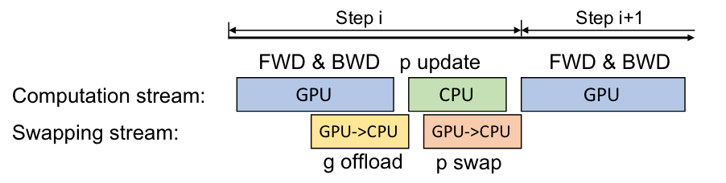

# ZeRO-Offload: Democratizing Billion-Scale Model Training

!!! abstract
    

    * Paper: [ZeRO-Offload: Democratizing Billion-Scale Model Training](https://www.usenix.org/system/files/atc21-ren-jie.pdf)

    * **ATC'21**: Proceedings of the Annual Technical Conference

## 介绍

### 摘要

ZeRO-Offload 期望降低大模型训练的成本，使得仅有有限 GPU 资源的研究者也可以进行大模型的训练。摘要中提到 ZeRO-Offload：

* 可以单卡训练 13B 参数的模型
* 将一部分数据与运算卸载到 CPU 上进行
* 在单张 NVIDIA V100 GPU 上达到 40 TFlops
* 可以支持多卡训练，实验表明在使用至多 128 张 GPU 训练时达到了接近线性的性能提升

### 引言与背景

**大模型训练中内存开销**来自于模型状态（参数、梯度、优化器状态）以及残余状态（激活值、临时 buffer 及内存碎片等），其中模型状态是大模型训练最主要的内存瓶颈。

!!! tips "内存开销"
    使用一个混合精度训练以及 Adam 优化器的训练框架，训练 $M$ 个参数的模型，至少需要 $16 \times M$ 字节的内存来存储模型状态：

    * **混合精度训练**
        * 保存两份**参数**，其中一份使用 fp16 存储、一份使用 fp32 存储，fp16 用来参与运算以提高运算速度，fp32 用来进行更新以避免 fp16 在累积过程中的精度不足问题，此处需要 **6** 字节
        * **梯度**参与运算，使用 fp16 保存，此处需要 **2** 字节
    * **Adam 优化器**
        * 梯度的**动量**与**方差**，使用 fp32 保存，此处需要 **8** 字节

现有工作从两个角度出发拓宽大模型训练时的内存限制：scale-out 与 scale-up。

**scale-out** 即聚合多片 GPU 的显存共同完成训练，如流水线并行、模型并行以及 ZeRO 驱动的数据并行方式，**流水线并行**与**模型并行**分别对模型以及残余状态进行了横向（分层）切割或纵向（多层的一部分）切割；**ZeRO** 则将训练 batch 和模型同时拆分到不同 GPU 上，使用 GPU 间的通信开销来交换每片 GPU 上的显存占用。可以发现 scale-out 的方法并不能减少**对显存的总需求量**，导致需要大量 GPU 资源才能完成大模型的训练任务。

**scale-up** 的方法主要通过三种途径降低对显存的需求：(1) 增加运算开销而减少激活值的存储数量，如 checkpoint 技术；(2) 使用低精度或混合精度训练，减少模型状态和激活值的显存开销；(3) 将一部分显存卸载到 CPU 内存上，但是现有工作主要使用了 CPU 内存本身，而没有充分利用 CPU 的运算能力来减少数据搬运的开销。

ZeRO-Offload 的设计希望可以做到：

* **Efficiency**: 最优的计算与数据分割，使得 CPU 和 GPU 上有合理的负载分配
* **Scalability**: 将卸载策略与模型并行以及 ZeRO 驱动的数据并行结合
* **Usability**: 不需要对模型进行重新设计和手工分割，在 DeepSpeed 中直接可用

## 最优卸载策略

不同模型拆分到 CPU 与 GPU 的方法主要是在权衡 **CPU 运算**以及 **CPU-GPU 通信的开销**，两者都有可能成为系统瓶颈。作者认为最优的卸载策略应该满足：

* **CPU 上的运算量**应比 GPU 上的运算量的**数量级更低**，因为 CPU 的运算效率更低，如果 CPU 与 GPU 的运算量相近，CPU 的运算将成为瓶颈
* **最少的 CPU-GPU 通信开销**
* 保证前两个需求的前提下，尽可能**最大化地将显存内容转移到 CPU 内存中**

为了获得最优卸载策略，作者将训练过程根据数据流动简化成了下图。左侧展示了 GPU 上进行混合精度训练时各种模型状态、残余状态的数据流动，箭头上的数值（如 $2M$）表示不同过程间需要传输的数据量。

如何保证 **CPU 上的运算量有更低的数量级**：训练中每一次迭代的复杂度为 $O(MB)$，其中 $M$ 为模型大小、$B$ 为训练 batch 大小。训练中前向与反向传播均为复杂度 $O(MB)$ 的运算，需要在 GPU 上完成；归一运算与参数更新的复杂度为 $O(M)$ 因此可以卸载到 CPU 上进行。如图右侧，将前向/反向传播组合为一个 *Super Nodes* 放置在 GPU 上进行，而参数更新则放置在 CPU 上进行。

如何保证**最少的 CPU-GPU 通信开销**：在上述设计的基础上，可以调整的是参数/梯度/优化器状态的放置位置，可以发现最少的开销情况是仅进行 fp16 的梯度与参数通信，即 $4M$ 的通信量（fp16 的梯度与参数各 $2M$）。这要求我们将 fp32 的参数、优化器状态都放置在 CPU 内存中，同时可以降低尽可能多的显存使用；同时需要将 fp16 的参数放置在 GPU 上来避免 fp16 的参数的 $4M$ 通信代价。

在上述设计的基础上，还可以调整 fp16 的梯度放置位置，依照尽可能多地降低显存压力的设计需求，将 fp16 的梯度放置在 CPU 内存中。

至此，获得了图中右侧的**最佳卸载策略**。GPU 负责前向与反向传播，保存了所有的激活值以及 fp16 的参数参与运算；CPU 负责进行参数更新以及从 fp32 到 fp16 的精度转变，保存了所有的 fp32 数据如参数、优化器状态（动量、方差）以及 fp16 的梯度值。

## ZeRO-Offload 训练

### 单卡训练

在一张 GPU 上的每轮训练：

* 从正向传播(FWD)开始，因为正向传播需要的 fp16 参数（下称*p16*）已经在 GPU 上，这一步不需要 GPU-CPU 通信
* 反向传播(BWD)过程中使用少量的临时 buffer 即可存放计算得到的 fp16 梯度（下称 *g16*），计算过程中每得到一个（或一组）梯度的最终值就可以传到 CPU 中，因此 g16 的卸载几乎与 BWD 重合
* 在反向传播后，GPU **陷入等待**，CPU 开始进行参数及优化器状态的更新，每获得一个更新的 fp32 参数（下称 *p32*）即将其对应的 p16 值传到 GPU 中，因此 p16 的上载几乎与 CPU 参数更新重合
* 参数更新结束后，CPU **陷入等待**，GPU 开启新的一轮 FWD&BWD

!!! note "图"
    图中作者把 CPU 和 GPU 的运算合并为 *Computation Stream*，直接看图的话容易忽略 GPU 的等待；图中 *p swap* 似乎是笔误，应为 *CPU->GPU*（？