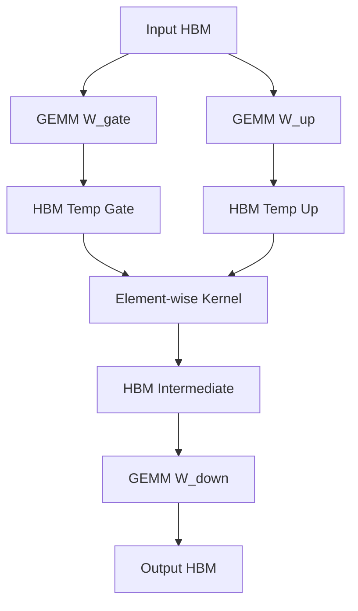
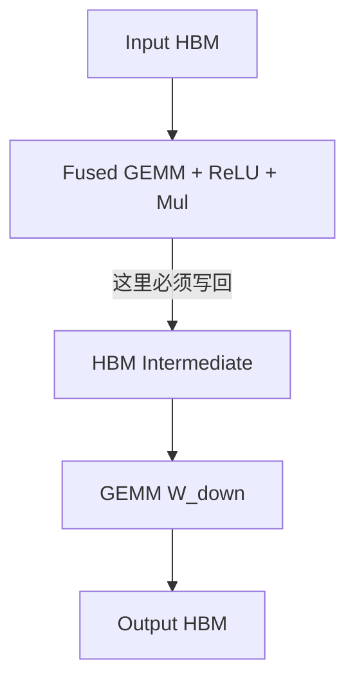
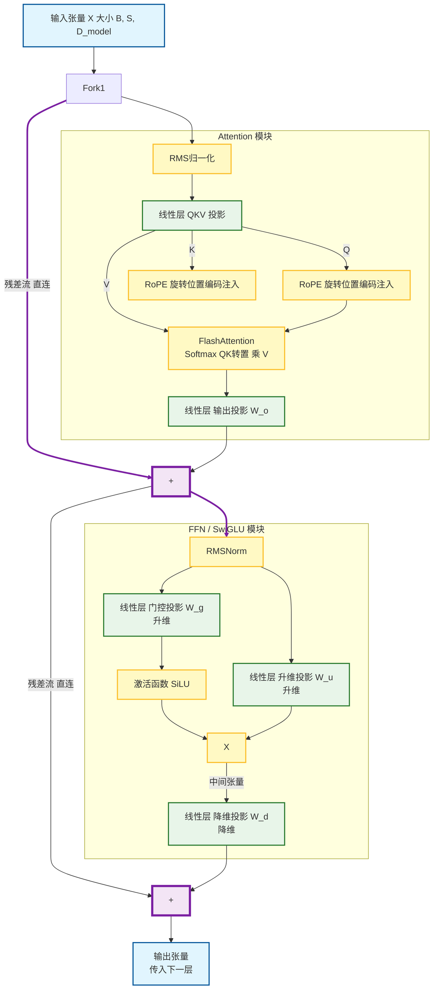

# 补天记录

```
一些补天记录，主要涉及 Transformer & Post-Training 原理（直观理解和公示结果为主）与对应代码记录（甚至不是解读啊喂）；针对大模型训练/推理/后训练过程的各种系统优化与代码记录。

这里的所有内容充斥着脑补、“俺寻思”和 AI 幻觉，不足以作为学习资料，纯粹个人发癫记录。
```

[TOC]

# Transformer

Transformer 是当前最流行的大模型基本结构，个人认为需要补充学习其基本原理和运算过程（从算法+ infra 角度）。初步计划进行下面这些内容的学习：Attention（从基础的 MHA 到 GQA、MQA）、RoPE、FFN(SwiGLU)、代码阅读（可能 llama2.c）。

## Attention - MHA

先放公式，对于一个简单的“单头”注意力来说，它的基本运算是 $\text{Attention}(Q, K, V) = \text{softmax}(\frac{QK^{T}}{\sqrt{D_{h}}})V$。下面直观理解一下注意力机制的运算过程：

- 首先需要对 $Q, K, V$ 这三个张量本身有个直观理解
    - $Q$ 即 query，可以直观理解为“我当前正在读的这个词，我想找什么相关的信息”
    - $K$ 即 key，可以直观理解为“我有什么特征，能被别人查询到”
    - $V$ 即 value，可以直观理解为“如果我和你的查询匹配了，我应该把什么信息传给你”
    ```
    给出一个例子来辅助理解：如果你在图书馆找书，那么你的书单就是 `Q`，它上边可能写着“关于大模型训练的书”；书架上的每一本书都有分类标签，比如“计算机系统”、“变形金刚”、“AI Infra”、“炒饭”，这个就是 `K`；你会对着书单计算和每一本书的相似度，找到匹配度高的书，你会把它抽出来阅读内容，这个内容就是这本书的 `V`。
    ```
- 在之后的讨论中，每个张量的维度都很重要，因此顺便在过程中标注了，假设我们一批处理 `B(atch)` 组向量，其中每个向量的大小都是 `[S(equence), D(imension)_h(ead)]`，至于这个大小有什么含义，暂时按下不表
- 先获取 $Q, K, V$，$Q=X \cdot W_Q, K = X \cdot W_K, V = X \cdot W_V$
    - $X$ 代表输入，其维度为 $B, S, D_h$
    - $W\_$ 表示对应的权重矩阵，其维度为 $D_h, D_h$
    - 在进行矩阵乘法时，会进行权重矩阵的广播，最终结果的维度是 $B, S, D_h$
- $QK^T$: $[B, S, D_h] \cdot [B, S, D_h]^T \rightarrow [B, S, S]$
    - 注意其中的转置针对的是后两维，即批内每个向量进行一次 $[S, D_h] \cdot [D_h, S]$ 的矩阵乘
    - 它的含义可以直观理解为，进行例子中的“匹配书单与书的标签相似度”的动作，得到的结果中每一行都是一条要求对另一本书的相似度
    - 需要特别关注这个中间结果的维度是 $[S, S]$，当我处理的序列长度增长时，这部分的显存占用会呈平方增长，这与后边计算过程中的显存优化有很大的关系
    - 得到的结果被称为分数矩阵(Attention Scores)
- $\frac{\cdot}{\sqrt{D_h}}$: $[B, S, S] \rightarrow [B, S, S]$
    - 在得到 $QK^T$ 的点积结果后，需要对这个结果进行一次缩放，缩放的比例是 $\sqrt{D_h}$ 即单头维度的根号
      - 一个很自然的问题是，为什么需要这次缩放？首先点积的计算过程是 $D_h$ 个乘积之和，可能导致计算结果中绝对值的差别很大（点积结果的方差变大），而 Sotfmax 的操作对数值大小很敏感，可能导致最终结果的概率值极其偏向（几乎非 0 即 1），在反向过程中，这样的分布会导致梯度几乎是 0，无法对参数 $W_Q, W_K$ 进行有效的更新
      - 为什么要除的是这个值？因为点积过程可以描述为 $\sum_{i=1}^{D_h}(q_i \cdot k_i)$，当 $q_i, k_i$ 都是随机变量（假设均值为 0 方差为 1），那么 $q_i \cdot k_i$ 的方差约等于 1，（因为每一维上的数据都是独立的，所以方差可加）点积结果的方差为 $D_h$，当我们对点积结果进行除 $\sqrt{D_h}$ （标准差的值）后，其方差被拉回到 1，以此保持数据稳定
- $\text{softmax}(\cdot)$: $[B, S, S] \rightarrow [B, S, S]$
    - 对每一行做 softmax，其公式为 $\text{softmax}(x) = \frac{e^{x_i}}{\sum{e^{x_j}}}$，可以发现计算后每一行的元素之和为 1，完成了一次归一化（将数值转换为了概率值）
- $\cdot V$: $[B, S, S] \cdot [B, S, D_h] \rightarrow [B, S, D_h]$
    - 加权求和，得出本层的结果，同时这一层的维度也恢复到了输入的维度大小

到这里已经对单头注意力有了基本的理解，现在我们将其拓展为“多头注意力”（Multi-Head Attention，MHA），简单理解就是同时搞出很多个注意力头，每个头都有“各自更关注的信息”，比如一个头专门注意上一个 token，一个头专门注意语法，一个头专门注意专有名词。（当然这个例子只是用来说明不同头关注的东西不同，并不是说我们能保证它们在分别关注我们设计的内容）

不同的头是并行进行计算的，后面的说明中我们用 `D_m(odel) i.e. total hidden size` 来指代所有头的维度之和，用 `D_h(ead)` 表示单头维度，它们的关系是 $D_m = H \times D_h$ 其中 $H$ 是注意力头数。

多头注意力的计算流程与单头注意力几乎相同，它通常将所有权重矩阵合并为 $[D_m, D_m]$，线性投影后得到 $[B, S, D_m]$ 的 $Q, K, V$；之后进行拆分和转置产生“多头”，会先将最后一维的 $D_m$ 拆分为 $H \times D_h$ 得到 $[B, S, H, D_h]$，交换维度提前“头”这一维，保证后续计算的显存连续，得到 $[B, H, S, D_h]$，之后不同头如单头注意力一般并行的分别进行注意力计算，进行转置和合并，得到输出 $[B, S, D_m]$，这个输出再与 $W_O$(Output Projection, $[D_m, D_m]$) 相乘，混合特征得到最终结果。与单头注意力相比，MHA 引入了一个可训练的权重 $W_O$，其作用是将多头的处理特征进行融合，得到最终的结果。

综上，可以将 MHA 的运算总结为：

$$MultiHeadAttention(Q, K, V) = Concat(head_1, head_2, \dots, head_h)W^O$$

其中，$$head_i = Attention(QW^{Q}_{i}, KW^{K}_{i}, VW^{V}_{i}), W^{\cdot}_{i} \in \mathbb{R}^{D_m \times D_h}$$

这里自然产生了两个问题：在 $D_m$ 固定的前提下，调整 $H$ 和 $D_h$ 有什么用处？如何保证不同头“关注”不同的特性？

因为限制 $D_m = H \times D_h$，头数和每头维度是呈反比的， 从算法的角度看，多头可能可以捕捉更多类型的特征关系，而少头的方案每个向量的信息更多，能够容纳更精细的信息；从计算角度看，在每个头分别进行注意力计算的时候，其计算矩阵大小是和 $D_h$ 相关的，而过小过多的 GPU 计算会带来开销。因此这是一个 trade-off，后边 FlashAttention 的学习可能能够补齐这部分内容，即如何选择 $D_h$ 的大小。

不同头关注不同信息，是比较玄学的说法，在模型初始化阶段，它们的权重矩阵是随机的，不同头的权重初始值并不相同，这在最开始保证了不同头一定是不一样的；而在训练过程中，可能通过 loss 的设计，要求每个头向其他方向发展，这部分尚待学习，没有完全理解。

我们可以发现，在 MHA 的设计下，每个头都有自己独立的 $K$ 和 $V$，如果每个头其实关注的东西都差不多，那么它们是不是可以进行合并？这就是后边的 MQA 和 GQA 的设计关注点。

## Attention - MQA

由于 MHA 的处理中，$Q, K, V$ 都有独立的注意力头来分别计算，整个计算过程涉及到大量的访存，（尤其是在推理的 decoding 阶段）将这个计算过程从“计算密集型”向“访存密集型”转移。Google 在 19 年的论文中提出了 MQA(Mutlti-Query Attention) 来解决这个问题，设计的整体思路就是仅保留 $Q$ 的多头，而共用一头的 $K, V$，这样的设计在保留多头注意力整合不同关注的同时，将 decode 过程从 MHA 的访存密集型转移回计算密集型，充分利用 GPU 的计算能力（而不至于被访存卡死）。

首先简介 MQA 的基本流程，与 MHA 几乎相同，其唯一的差别在于，MHA 的运算过程中 $K, V$ 都是由多个注意力头进行运算处理的（其 shape 在计算过程中为 $[B, S, H, D_h]$），而在 MQA 的设计下，仅 $Q$ 的大小不变，$K, V$ 均只保留一个头（即 shape 为 $[B, S, 1, D_h]$）。（之后在推理流程的学习里可能对这部分内容再做补充）

第一个问题是，MQA 仅仅将 $K, V$ 从多头改为单头，怎么能“将 decoding 阶段 MHA 的访存密集型转变为计算密集型”？关键在于对 GPU 访问 HBM 的总数据量和 GPU Cache 命中率上进行分析。在 MHA 的计算过程中，一次 Attention 运算需要访问 $[B, S, H, D_h]$ 的 $Q, K, V$，而它们的每个维度都各不相同，无法在 GPU cache 上形成命中，对 HBM 的访存量极大。而在 MQA 的设计下，除了 $Q$ 还是访问原来的大小之外，$K, V$ 在运算过程中访存行为的链条就短了许多，它们本身的大小是 $[B, S, 1, D_h]$ 而在运算过程中会**广播**到 $[B, S, H, D_h]$ 的大小参与运算，需要注意这里的广播并不是物理上将它们拷贝 $H$ 份，而是设计一个逻辑上的访问限制，即进行了一次地址映射，比如访问第 3 个头的向量时，实际上还是被映射到了仅有的那个头对应的向量上，而 MQA 下 Q 的多头注意力并行计算时访存行为几乎相同，因此能够命中还在 GPU Cache 上的 $K, V$ 向量，而不需要从 HBM 中获得，这将 Attention 的访存压力下降，能够更加充分的利用 GPU 的计算。

第二个问题是，为什么刚才一直强调是 decoding 阶段，而不说推理的 encoding(prefill) 阶段？因为 encoding 阶段 token 是一股脑送进来的，它本身并不伴随 KV cache 的压力以及转变为访存密集型的压力（因为可以合并为大矩阵运算，充分利用计算能力），而 decoding 阶段一次只处理一个 token，它不能满足 GPU 的计算能力，进而转变为了访存密集。

第三个问题是，共用单头 $K, V$ 是否会对效果有极大影响？初步结论是会有影响，但不大，几乎可以通过多训几轮来弥补。MHA 下实际上会存在“多头关注相同特征”的可能性，这个冗余性意味着可以对“多头”进行压缩，而 MQA 就是其中比较极限的压缩方式。而在压缩的前提下，MQA 还保留了 $Q$ 的多头特性，通过 query 的多头来“领导”对多样特征的关注，对训练过程没有特别严重的影响。同时，在 MHA 和 MQA 中都有一个 $W_O$ 对多头的特征进行融合，这可以看作是一种兜底，能够一定程度上弥补 MQA 对 KV 压缩带来的能力损失。

总结来看，MQA 利用 MHA 的冗余性进行压缩，减少对显存的访问（增加 cache 命中率）。对于推理过程，在 encoding 过程没有明显提升，但对于 decoding 阶段有极大提升。其最大优势是提升了推理阶段的吞吐和降低了 decoding 阶段的延迟；而对 encoding 阶段没有特别的好处。

## Attention - GQA

MHA 显存占用多、访存压力大，而 MQA 则面临 KV 存储信息过少实际效果较差的问题，GQA(Grouped Query Attention) 则是两个方案的折中。它保留了 MHA 和 MQA 对 $Q$ 的处理，即拥有完整的头数，而将 $Q$ 的不同头进行分组，每个组对应一个 $K, V$ 头。比如 $Q$ 有 $H_Q$ 头，分为了 $G$ 组，则 $K, V$ 就各有 $H_{\{K, V\}} = H_Q \div G$ 头。举个例子，$H_Q=32, G=8$ 时，每 4 个 Q 对应一组 K/V，即在运算过程中 $Q_{0\dots 3}, Q_{4\dots 7}\dots Q_{28\dots 31}$ 分别对应 $K_0(V_0), K_1(V_1), \dots, K_7(V_7)$。

GQA 实际上是对模型进行了一种结构化的剪枝，要求模型在训练时将相似的信息压缩到同一个 KV 组里，避免冗余性对模型过多的影响，同时减少仅有一组 KV 带来的信息丢失或处理能力下降。

与 MQA 类似，GQA 也可以将 Attention 计算过程中对 $K, V$ 的访存大小降低，区别在于 MQA 会降低 $H$ 倍，而 GQA 会降低 $G$ 倍，因此 GQA 也可以加速 decoding 阶段，而相比于 MQA 对模型质量有了进一步的保证。

至此，基本的几个 Attention 概念已经了解完全（MHA、MQA、GQA），可以对他们进行一定总结如下：

|   特性   	| MHA(Multi-Head) 	| GQA(Grouped-Query) 	| MQA(Multi-Query) 	|
|:--------:	|:---------------:	|:------------------:	|:----------------:	|
|  Q 头数  	|      H(32)      	|        H(32)       	|       H(32)      	|
|  KV 头数 	|      H(32)      	|        G(4)        	|         1        	|
| 显存占用 	|     高(100%)    	|     中(~41.67%)    	|    低(~35.42%)   	|
| 推理速度 	|  慢(I/O bound)  	|         快         	|       极快       	|
| 模型效果 	|       最好      	|      几乎无损      	|    有明显损失    	|

# Tokenizer & Embedding Layers

```
之前一直以为 Tokenizer 是个很神秘的东西。。。
```

Tokenizer 是数据准备&模型输入输出阶段需要使用的组件，它在数据输入层主要负责做这样的动作：`原始字符串(string) -> 分词后得到 token list（内容都为 string） -> 查表将 token 从字符串转换为数字`，即完成了一个从连续字符串到离散的 token 索引列表的动作。Tokenizer 需要关注的点如下：

- Tokenizer 的大小主要取决于词表(Vocabulary)大小 Vocab Size($V$)，它的大小会影响模型第一层和最后一层的大小（至于是什么后边会介绍）
- Tokenizer 本身在大模型训练过程中是不训练的（即不发生改变），它本身就是一个 token 到索引的映射表，其建立过程在大模型训练开始之前它的大小会影响模型第一层和最后一层的大小（至于是什么后边会介绍）
- Tokenizer（dataloader）通常是在 CPU 上完成的
- 训练过程中，为了把不同长度的句子放到同一个 Batch 里并行计算，会需要做 padding，用一个约定好的数值（比如 0）补齐短句子生成的 token list，而在 attention 运算是传入一个 mask，保证这些 padding 得到的分数一定是不会被选中的（比如负无穷）

可以看到，经过 tokenizer 的操作，我们将一段纯文本变为了一个整数列表，而我们在实际训练（比如之前的 attention 计算）中一直在处理“浮点数”，它们之间的关联是什么？

这个问题由 Embedding 层的引入来解决，大模型的第一层通常是对输入进行 Embedding，所谓的 embedding 就是将 token 进行向量化，从正数索引变为一个向量，经过输入 embedding 之后，我们的字符串就会变为一个矩阵了，而这个矩阵的获得就是由一个 token 查表得到的浮点向量构成。这个矩阵还需要引入“位置”的概念之后，送到后续层参与计算，这个位置编码就是后边学习的内容（比如 RoPE 来解决的）。在所有中间层计算结束后，我们会得到一个最终的结果向量，将这个结果向量和最后输出 embedding 层（或者叫 `lm_head`）相乘，获得一个和词法表大小相同的向量，这个向量代表着接下来输出每个 token 的概率，经过筛选后得到索引，并用这个索引从 tokenizer 查表得到最终的输出字符串。

输入/输出 embedding 层就是之前所说和词法表大小相关的层，它们的大小都是 $[V, D_m]$。需要注意，它们在大模型训练过程中都是可训练的。

至此我们可以理清数据格式的变化：`text(string) --tokenizer--> interger list --InputEmbedding--> X matrix --HiddenLayers--> Output Vector --OutputEmbedding--> Float vector --softmax--> index of output token --detokenizer--> output string`。

## 位置编码 - RoPE

首先需要理解为什么大模型需要进行位置编码，比如这句话：“我被狗咬了”。在没有位置编码的情况下，模型只能意识到“我”和“狗”的关系（可能也能意识到“咬”这个动词与前面两个名词的关系），但是它对位置并没有严格的理解，在它的处理模式中这句话和“狗被我咬了”没有什么区别。因此我们需要为模型添加一个**位置的信息**。

一个很自然的思路是直接给不同位置分配一个单独的向量来进行位置的描述，然后直接加到词向量上，但是 naive 的处理存在两个问题，一个是因为要给每个词的位置都设置一个独特的向量，模型能够处理的序列长度也就被限制了（超出有位置向量的位置以后，就不知道怎么描述了），而且很难追踪到 token 之间的相对位置，这种模式叫做绝对位置编码。

相应的，还有一种相对位置编码方式，它不改变输入的词向量，而是在计算 Attention 的时候为它添加一个偏置项 $Score = QK^T + \text{Bias}(|i-j|)$。这种设置的方式是外推性好，在整数表达范围内可以设置任意长度的序列，而问题也很明显，就是每次计算 Attention 的时候都需要进行一次 bias 计算或者查表的代价。

RoPE 是一种利用绝对编码方式实现相对编码效果的位置编码方法，其主要思路是将位置看作**角度**而不是数字或向量，举个简单例子，如果 hidden dim 为 2，在平面上，对于第 0 个词不做旋转，第一个词逆时针旋转 $\theta$，第 $m$ 个词逆时针旋转 $m\theta$。它发生作用的位置主要是在 Attention 计算的主要过程 $QK^T$，这是一个点积计算，如果我们把 $q_m$ 旋转了 $m\theta$ 而将 $k_n$ 旋转了 $n\theta$，它们的内积结果会取决于它们旋转的差值 $(m-n)\theta$，这意味着 Attention 可以获取 Q 和 K 的相对位置信息。

这里先介绍 RoPE 的计算过程：假设每个头的维度 $D_h = 128$，我们将其成对分配为 64 对，每两个连续的数看作一个二维向量，而对于每一对 $(x_1, x_2)$ 对于位置 $m$ 都有一个对应的旋转矩阵：

$$
\begin{pmatrix} \cos m\theta & -\sin m\theta \\ \sin m\theta & \cos m\theta \end{pmatrix} \begin{pmatrix} x_1 \\ x_2 \end{pmatrix}
$$

其对应了计算 $x_{new_1} = x_1\cos(m\theta) - x_2\sin(m\theta)$ 以及 $x_{new_2} = x_1\sin(m\theta) + x_2\cos(m\theta)$，几何含义上就是对向量 $(x_1, x_2)$ 逆时针旋转 $m\theta$ 角度后得到的向量。

为了能够实现对长短举例跨度的敏感性区别，RoPE 设置了一个转速衰减的方式，根据不同上下文长度要求，可以设置一个长度为 $D_h/2$ 的角度列表 $\Theta = \{\theta_0, \theta_1, \dots, \theta_{D_h/2}\}$ 其中 $\theta_i = 10000^{-2i/D_h}$，10000 是一个可以根据希望模型处理上下文长度变化的固定值。在这种设置下，每一对子向量旋转的速度是不一样的，越靠前的维度转得越快，越靠后的转得越慢。

在得到计算方式之后，我们希望能将这个过程变成一个固定的高效的运算模式，可以用查表的方式避免过多 cos sin 的计算：

- `cos_table`: $[\cos(m\theta_0), \cos(m\theta_0), \cos(m\theta_1), \cos(m\theta_1), \dots]$
- `sin_table`: $[\sin(m\theta_0), \sin(m\theta_0), \sin(m\theta_1), \sin(m\theta_1), \dots]$

注意表中每个 $\theta$ 都出现了两次，是因为连续的两个维度都共用一个 $\theta_i$。关注到之前的算式中有 $x_{new_1} = x_1\cos(m\theta) - x_2\sin(m\theta)$，在计算过策划概念中需要构造一个特殊的变换向量：将输入 $x$ 两两配对进行取反和变换，即对于 $x = [x_0, x_1, x_2, x_3, \dots$ 变换为 $x_{rot} = [-x_1, x_0, -x_3, x_2, \dots]$，利用我们现有的 `x, x_rot, cos_table, sin_table` 可以得到 RoPE 的最终计算方式：

$$
\text{Output} = x \times \text{cos\_table} + x_{\text{rot}} \times \text{sin\_table}
$$

这里有一个重点需要关注的内容：RoPE 作用在什么地方？它并不是通过给词向量加偏移来实现，而是在每一层 Attention 的**线性变换之后 QK 内积之前**，即将原本的 Attention 过程变为：

- 利用输入 $X$ 和权重 $W_Q, W_K, W_V$ 获得 $Q, K, V$ 并根据需要进行分头
- **注入 RoPE 相对位置信息**，计算 $Q_{\text{rot}} = \text{RoPE}(Q, position_ids)$ 以及 $K_{\text{rot}} = \text{RoPE}(K, postion_ids)$，需要注意**$V$并不会进行任何操作，保持原样，因为 value 并不会因为位置信息而有改变
- 之后进行分数计算 $Scores = Q_{\text{rot}} \cdot K_{\text{rot}}^T, Prob = softmax(Scores), Output = Prob \cdot V$

这里一个问题进行分析：为什么 RoPE 可以对不同长度的相对位置进行处理。

首先需要理解 RoPE 是怎么提供相对位置的，我们可以将掺入 RoPE 的 Attention 分数写为：

$$
Score_{new} = (原语义相似度) \times \cos((m-n)\theta) + (交叉项\dots)
$$

而其中交叉项虽然复杂，但在统计上趋近于 0，可以忽略。可以发现主导项中 RoPE 就是提供了一个乘法因子 $\cos((m-n)\theta)$，这个乘法因子只跟距离有关，并且是一个真当衰减的权重，当 $m=n$ 时（自己看自己）相似度保持 100%，而当两者距离较大时，有 $D_h/2$ 个不同的 $\theta$ 从快到慢震荡变化，这些余弦函数的叠加效应会导致总的 Attention Score 期望值逐渐下降，这就是我们希望的一个隐式的距离衰减偏置，它会让模型理解如果不考虑语义，离得越远的词，它们的关联分数应该越低。

而训练过程中，权重矩阵 $W_Q, W_K$ 会学会利用这些 cos 波形，分出不同的头关注不同的内容，比如特定的头关注高频维度（因为 cos 值变化很快，稍微远一点分数就会掉的厉害）只高度关注周围的一两个词，而特定的头关注低频维度来关注比较远的内容。

回到最开始的例子，“我咬狗”和“狗咬我”，在没有位置信息的时候“我”和“狗”算出的 Attention 在两个句子里是一样的，而引入了 RoPE 后，在“我咬狗”中从“咬”看“我”相对位置是 1，第二个句子中相对位置是 -1，而 $\sin(\theta)$ 和 $\sin(-\theta)$ 是一个相反数，模型可以从里面学习到主动关系。

RoPE 为什么会成为现在模型的标准呢？主要是因为以下特性：

- 相对位置感知能力，这对理解长文本中的依赖关系非常重要
- 长文本外推性，对于绝对位置编码来说，训练过程设置的文本长度为 2048 那么模型就只能推理长度 2048；而 RoPE 应用后训练时 2048 却能外推到推理 4096 甚至更多的上下文长度，且性能下降平缓
- 显存与计算高效，可以看到它不需要维护一个巨大的可训练参数，而只需要长期保持两个 $D_h$ 长度的 sin cos 表，并且直接作用于 Q K 不会破坏 Attention 的计算结构，从而可以适配原版 FlashAttention

## FFN

FFN(Feed-Forward Network) 也是 Transformer 的重要组成部分，它占据了模型参数量的一大部分。一个经典的 Transformer 块组成为 `Input -> Attention -> Add&Norm -> **FFN** -> Add&Norm -> Output`，其中 Attention 由上述内容可知主要是关注词与词之间的关系，而 FFN 就主要负责消化这些信息，并检索在训练中学到的静态知识。

FFN 主要有经典（MLP）和现代（SwiGLU）两大种结构。下面分别进行介绍：

**MLP(Multi-Layer Perceptron, 多层感知机)**

在原始的 Transformer 论文和早期架构 BERT、GPT-2 等结构中均使用了 MLP 作为其 FFN 的实现。它的结构由两层线性变换（先升维、再降维）和夹在中间的一个激活函数构成，流程是 `input x -> Up_Proj -> Activation(ReLU/GELU) -> Down_Proj -> output x_out`，其中升维使用的矩阵 $W_{up}$ 基本都是大小 $[D_{model}, 4D_{model}]$，而降维矩阵 $W_{down}$ 的大小对应为 $[4D_{model}, D_{model}]$。其中激活层不需要独立的可训练的矩阵，它是对升维后的矩阵进行一个逐 element 计算。

MLP 是一个 memory bound 的过程，比如激活层它对矩阵中每个元素进行一个简单运算后就不再使用，无法利用 cache，因此通常会将 MLP 的升维和激活进行一个融合，这里简单介绍一下：对于一个简单的升维+激活操作 $ReLU(X\cdot W + b)$ 如果不经设计，整个操作可能经过多个对 HBM 的读写（GEMM 写出、Bias 读取/写出、ReLU 读取/写出），而没有充分利用 GPU 内存层级中的寄存器这个访问最快的介质。如果在 kernel 中要求计算完第一个升维的矩阵乘法+bias 参算+每个元素的 ReLU 计算后，再写回中间矩阵中，充分利用 cache 层，减少显存带宽占用。

优化前的 HBM 读写：



优化后的 HBM 读写：



**引入门控的 FFN（以 SwiGLU为例）**

MLP 是对输入进行了一个简单的升维、激活、降维过程，而以 SwiGLU 为代表的架构引入了“门控”机制，以 SwiGLU 为例，它增加了一个 GLU(Gated Linear Unit) 表现为一个门控矩阵 $W_{gate}$，它的操作是参算输入与这个矩阵的乘 $Gate = x \cdot W_{gate}$，之后用升维后的矩阵和 sigmoid 后的门控值进行一个筛选 $Content \odot Sigmoid(Gate)$，若 Gate 的输出是 1 则 content 全部通过，若 Gate 的输出是 0.5 则减半通过，若输出为 0 则拦截（其中 $\odot$ 的操作是矩阵中对应位置元素相乘）。

总结来看，SwiGLU 就是激活层用 sigmoid 再加上一个门控矩阵的 FFN，其公式可以描述为 $SwiGLU(x) = (SiLU(x\cdot W_{gate}) \odot (x\cdot W_{up})) \cdot W_{down}$。新增的门控矩阵 $W_{gate}$ 为其带来了更强的特征筛选能力，可以使得模型动态地决定每一层应该保留什么知识，但是也引入了一个问题——它比 MLP 多了一个同样巨大的矩阵，这导致中间层的维度通常不能像 MLP 一样设置为 4，因为这会使得模型参数量爆增，因此通常来说会设置一个魔法数 $\frac{8}{3}\approx 2.667D_{model}$ 作为其中间维度大小。（这个魔法数的计算就是对标标准 MLP，中间层大小为 $4D_{model}$ 的每层 FFN 大小得来的）当然为了在计算的时候对齐，通常在这个值的前后找到一个 `128/256` 的倍数，用来对齐 GPU 内存和 Tensor Core。

## 残差连接

早期的网络中数据是一层一层直接传下去的 $y=F(x)$，而残差连接就是在输出的时候将输入也加入进来形成 $y = x + F(x)$，这样做将 $F(x)$ 从结果变成了对输入的变化量。一个直观的理解是，不加入残差连接的情况下，模型就像在一层层传话，可能传着传着意思就变了，最初的信息就没有了；而加入残差连接后，不过经过多少层，最初的信息都还存在在每一层的输出中，类似于每一层都对一个草稿增加修改意见，而不是整个覆写。

引入残差连接是因为它的关键能力：解决“梯度消失”的问题，我不想深入了解这部分内容，所以只做一些直观理解。残差连接提供了一个反向传播中的快速道路，在链式法则下，梯度的传递是一个连续的乘法 $G_{final}\times G_n \times \dots G_1$，如果中间的层有一些阻碍（比如导数值小于 1），那么乘了 100 次之后，整个梯度值就会很小很小（接近 0），导致前面的层根本不会被训练，而加入残差连接后，梯度变为了 $\frac{\partial{y}}{\partial{x}} = 1 + \frac{\partial{F}}{\partial x}$，这个 1 的引入使得连续的乘法中每一个部分都至少在绝对值上有一个 1 的通道，不会因为连乘导致前面的层收不到梯度变化的信息。

同时残差连接使得如果一层对任务没有帮助，它可以将权重训练为 0，使得 $y=x$，这比学习一个恒等映射更容易，起码保证了随着层数的加深，模型的能力至少不会变差。

## 归一化

经过前面的学习，可以发现在 Transformer 的结构中（尤其是多层相连时），广泛使用了残差连接，它会使得每一层都在向之前的输入上夹东西，如果不进行控制，输出数据的方差会越来越大，最终导致梯度爆炸。这需要用归一化 Normalization 进行控制，将传递的数值强行拉回到一个标准的分布中，保证即便在多层网络结构下，数值范围依旧是稳定的。同时，归一化后的数据面更平滑，能支撑在训练时使用更大的学习率，加速模型的收敛。

**LayerNorm**

早期的模型中通常使用 LayerNorm，它的核心假设是数据的“均值”和“方差”都很重要。其主要流程如下（考虑向量 $x = [x_1, x_2, \dots, x_d]$）：

- 去中心化，将所有数据减去均值，使数据以 0 为中心。
$$
\mu = \frac{1}{d}\sum{x_i}\\
x' = x - \mu
$$
- 重缩放，计算方差，数据除以标准差（其中 $\epsilon$ 的作用是防止除 0）
$$
\sigma = \sqrt{\frac{1}{d}\sum(x_i-\mu)^2}\\
\hat{x} = \frac{x'}{\sigma + \epsilon}
$$
- 仿射变换，乘以可学习的参数和偏置
$$
y = \hat{x}\cdot \gamma + \beta
$$

**RMSNorm(Root Mean Square Norma)**

较新的模型都使用 RMSNorm 替代了 LayerNorm，它的核心假设是数据的均值不重要，只有“幅度”影响最大。其算法流程不会去计算均值，而是直接使用均方根进行归一化计算，同时最后只需要乘以一个可学习的参数，而不加偏置：

$$
\text{RMS}(x) = \sqrt{\frac{1}{d}\sum_{i=1}^{d}{x_i^2}}\\
\hat{x} = \frac{x}{\text{RMS}(x) + \epsilon}\\
y = x\cdot \gamma
$$

RMSNorm 的提出者是因为发现 LayerNorm 的收益绝大部分来自于除以方差，而减去均值对模型效果的贡献很小，因此直接把均值相关的计算跳过了。这在系统角度带来的收益显而易见，它减少了 Norm 层大量的标量计算（加减），虽然 GPU 很善于处理这些计算，但是能减少一点是一点 XD

可以看到 RMSNorm 也需要维护一个可学习的参数，它是一个一维向量，shape 为 $[1, D_{model}]$，在整个模型中占比很小。

与之前提到的 FFN 将不同算子融合类似，RMSNorm 的计算和前（有时是后）面的 Residual Add 进行融合，减少对显存带宽的压力，提高整体效率。因为 Residual Add 就是简单的对输出结果和输入结果进行加，相当于在 RMS 前进行一次加法操作，而不直接写回到 HBM 中，而是将数据留在 cache 内计算完 RMSNorm 再写回，节省了一次完整的 HBM 读写。

## 总结来看

目前已经将 Transformer 最基本的结构和直观上的作用有了初步了解，对部分系统层面的优化也有了理解，现在用一个流程图对上述内容进行总结梳理，方便后边的源码阅读随时查阅：



## 源码阅读

阅读 [HuggingFace Transformer](https://github.com/huggingface/transformers) 的 [llama/modeling_llama.py](https://github.com/huggingface/transformers/blob/main/src/transformers/models/llama/modeling_llama.py)，对应一下之前所学的内容，主要想法是跟着 Transformer Block 的计算过程，理一下每个子模块的计算模式，只是从 python 这一层应该是看不到对具体计算/访存的优化了。

### RMSNorm

```python
@use_kernel_forward_from_hub("RMSNorm")
class LlamaRMSNorm(nn.Module):
    def __init__(self, hidden_size, eps=1e-6):
        # eps 即 epsilon，用于确保不会除零
        """
        LlamaRMSNorm is equivalent to T5LayerNorm
        """
        super().__init__()
        # Norm 层需要有一个一维向量的参数，可学习
        # 可以看到它的 shape 就是 (hidden_size) 或者说我们之前的 D_model
        self.weight = nn.Parameter(torch.ones(hidden_size))
        self.variance_epsilon = eps

    def forward(self, hidden_states):
        input_dtype = hidden_states.dtype
        # 这一层计算的时候使用 fp32 的精度
        hidden_states = hidden_states.to(torch.float32)
        # 这一步是先计算每个参数的平方，mean 即计算平方的均值，最终的结果就是 RMS(x)^2
        variance = hidden_states.pow(2).mean(-1, keepdim=True)
        # rsqrt 是逆平方根，等价于 1/\sqrt(RMS(x)^2 + epsilon)
        # 这里 epsilon 作用的地方和上文略有差异，不过区别不大，都是保证分母不为 0
        hidden_states = hidden_states * torch.rsqrt(variance + self.variance_epsilon)
        # 返回前将类型恢复（混精训练时可能是 fp16 bf16 等）
        return self.weight * hidden_states.to(input_dtype)

    def extra_repr(self):
        return f"{tuple(self.weight.shape)}, eps={self.variance_epsilon}"
```

### RoPE

更多的 RoPE 相关 utils 在 [modeling_rope_utils.py](https://github.com/huggingface/transformers/blob/main/src/transformers/modeling_rope_utils.py)中。

```python
class LlamaRotaryEmbedding(nn.Module):
    inv_freq: torch.Tensor  # fix linting for `register_buffer`

    def __init__(self, config: LlamaConfig, device=None):
        super().__init__()
        # 设置最长处理的 seq 长度
        # 区别在于 max_seq_len_cached 会动态变化，当处理的序列长度不超过这个值是可以直接复用 rope 之前处理的数据
        # 当超过这个值时，会进行动态更新，并同时修改所有 rope 所需的 cache 内容
        self.max_seq_len_cached = config.max_position_embeddings
        self.original_max_seq_len = config.max_position_embeddings

        self.config = config

        self.rope_type = self.config.rope_parameters["rope_type"]
        # 调取不同的 rope 初始化方法，详见引用的 modeling_rope_utils
        rope_init_fn: Callable = self.compute_default_rope_parameters
        if self.rope_type != "default":
            rope_init_fn = ROPE_INIT_FUNCTIONS[self.rope_type]
        # inv_freq 即后面计算 cos/sin table 所要的角度列表，之后用 sin(inv_freq) 即可获得 sin table
        inv_freq, self.attention_scaling = rope_init_fn(self.config, device)

        self.register_buffer("inv_freq", inv_freq, persistent=False)
        self.register_buffer("original_inv_freq", inv_freq.clone(), persistent=False)

    @staticmethod
    def compute_default_rope_parameters(
        config: LlamaConfig | None = None,
        device: Optional["torch.device"] = None,
        seq_len: int | None = None,
    ) -> tuple["torch.Tensor", float]:
        """
        Computes the inverse frequencies according to the original RoPE implementation
        Args:
            config ([`~transformers.PreTrainedConfig`]):
                The model configuration.
            device (`torch.device`):
                The device to use for initialization of the inverse frequencies.
            seq_len (`int`, *optional*):
                The current sequence length. Unused for this type of RoPE.
        Returns:
            Tuple of (`torch.Tensor`, `float`), containing the inverse frequencies for the RoPE embeddings and the
            post-processing scaling factor applied to the computed cos/sin (unused in this type of RoPE).
        """
        base = config.rope_parameters["rope_theta"]
        # 即单头维度
        dim = getattr(config, "head_dim", None) or config.hidden_size // config.num_attention_heads

        attention_factor = 1.0  # Unused in this type of RoPE

        # Compute the inverse frequencies
        # 分步分析：
        #  1.0 / ~: 取倒数，对应幂上的负号
        # base ** : 底为 base，默认 10000，和 rope 能关注的最远位置有关，可以调整
        # arange(0, dim, 2) 只取偶数索引，即 [0, 2, ..., D//2]
        # 它对应了一个 D_head//2 大小的角度列表，\theta^i = base^{-2i/D_head}
        inv_freq = 1.0 / (
            base ** (torch.arange(0, dim, 2, dtype=torch.int64).to(device=device, dtype=torch.float) / dim)
        )
        return inv_freq, attention_factor

    @torch.no_grad()
    @dynamic_rope_update  # power user: used with advanced RoPE types (e.g. dynamic rope)
    def forward(self, x, position_ids):
        # 看起来是 rope 动态调整 cos/sin table 的时候调用的方法，可以用来看它从角度列表到 table 的过程
        # 扩展维度，从 [D//2] --> [Batch, D//2, 1]
        inv_freq_expanded = self.inv_freq[None, :, None].float().expand(position_ids.shape[0], -1, 1).to(x.device)
        # 扩展维度，[Batch, seq_len] --> [Barch, 1, seq_len]
        position_ids_expanded = position_ids[:, None, :].float()

        device_type = x.device.type if isinstance(x.device.type, str) and x.device.type != "mps" else "cpu"
        with maybe_autocast(device_type=device_type, enabled=False):  # Force float32
            # 计算旋转角度 inv_freq x position_ids --> [Batch, D//2, seq_len]
            # 转置为 [Batch, seq_len, D//2]
            freqs = (inv_freq_expanded.float() @ position_ids_expanded.float()).transpose(1, 2)
            # 拼接 freq 完成复用，组成 [theta0, theta1, ..., theta_D//2, theta0, theta1, ..., thetaD//2]
            emb = torch.cat((freqs, freqs), dim=-1)
            cos = emb.cos() * self.attention_scaling
            sin = emb.sin() * self.attention_scaling

        return cos.to(dtype=x.dtype), sin.to(dtype=x.dtype)


def rotate_half(x):
    """Rotates half the hidden dims of the input."""
    # 对于 x = [x0, x1, ..., x_2k-1]
    # 处理为 [-x_k, -x_k+2, ..., -x_2k-1, x0, x1, ..., xk-1]
    x1 = x[..., : x.shape[-1] // 2]
    x2 = x[..., x.shape[-1] // 2 :]
    return torch.cat((-x2, x1), dim=-1)


@use_kernel_func_from_hub("rotary_pos_emb")
def apply_rotary_pos_emb(q, k, cos, sin, unsqueeze_dim=1):
    """Applies Rotary Position Embedding to the query and key tensors.

    Args:
        q (`torch.Tensor`): The query tensor.
        k (`torch.Tensor`): The key tensor.
        cos (`torch.Tensor`): The cosine part of the rotary embedding.
        sin (`torch.Tensor`): The sine part of the rotary embedding.
        unsqueeze_dim (`int`, *optional*, defaults to 1):
            The 'unsqueeze_dim' argument specifies the dimension along which to unsqueeze cos[position_ids] and
            sin[position_ids] so that they can be properly broadcasted to the dimensions of q and k. For example, note
            that cos[position_ids] and sin[position_ids] have the shape [batch_size, seq_len, head_dim]. Then, if q and
            k have the shape [batch_size, heads, seq_len, head_dim], then setting unsqueeze_dim=1 makes
            cos[position_ids] and sin[position_ids] broadcastable to the shapes of q and k. Similarly, if q and k have
            the shape [batch_size, seq_len, heads, head_dim], then set unsqueeze_dim=2.
    Returns:
        `tuple(torch.Tensor)` comprising of the query and key tensors rotated using the Rotary Position Embedding.
    """
    # 扩展维度，让 cos/sin table 可以广播到 KV 的维度（适配多头）
    cos = cos.unsqueeze(unsqueeze_dim)
    sin = sin.unsqueeze(unsqueeze_dim)
    # 核心计算
    q_embed = (q * cos) + (rotate_half(q) * sin)
    k_embed = (k * cos) + (rotate_half(k) * sin)
    return q_embed, k_embed
```

可以看到，实际上这里的 rope 实现并不是像我们之前说的相邻两个维度配对，而是相隔 $D//2$ 的维度配对（比如 hidden_size=8 时，(0, 4), (1, 5)), ... 是相互配对的），但是这并不会影响我们之前所说的效果，重点在于 $\theta_i$ 的不同。

## Attention

modeling_llama.py 使用了支持多头注意力实现，并通过 `ALL_ATTENTION_FUNCTIONS` 提供了多种 attention 实现（包括 flashattention、pafedattention 等），这里先跳过对具体 attention 实现的阅读，在后面系统优化章节再详细学习 [modeling_utils.py](https://github.com/huggingface/transformers/blob/main/src/transformers/modeling_utils.py#L4711)。

```python
def repeat_kv(hidden_states: torch.Tensor, n_rep: int) -> torch.Tensor:
    """
    This is the equivalent of torch.repeat_interleave(x, dim=1, repeats=n_rep). The hidden states go from (batch,
    num_key_value_heads, seqlen, head_dim) to (batch, num_attention_heads, seqlen, head_dim)
    """
    # 将传入的 k/v tensor 注意力头的维度进行拓展，需要注意，这里并不是“广播”，而是确实申请了更大的内存
    batch, num_key_value_heads, slen, head_dim = hidden_states.shape
    if n_rep == 1:
        return hidden_states
    # 这里使用 expand，只是在 tensor 视图上逻辑拓展，并没有分配更大的内存空间
    hidden_states = hidden_states[:, :, None, :, :].expand(batch, num_key_value_heads, n_rep, slen, head_dim)
    # 这里返回时 reshape，确实分配了更大的内存空间
    return hidden_states.reshape(batch, num_key_value_heads * n_rep, slen, head_dim)

def eager_attention_forward(
    module: nn.Module,
    query: torch.Tensor,
    key: torch.Tensor,
    value: torch.Tensor,
    attention_mask: torch.Tensor | None,
    scaling: float,
    dropout: float = 0.0,
    **kwargs: Unpack[TransformersKwargs],
):
    # 是最简单的 attention 实现，看起来对应了之前所学的 GQA
    # 在 modeling_llama 中用于找不到 ATTENTION_INTERFACE 时的 default 实现

    # 为 k v 进行拓展，用来匹配后续计算的维度
    # 注意，这里是确实对 k v 进行了拓展，占用了更大的显存，目的是为了后续 matmul 的时候维度匹配
    key_states = repeat_kv(key, module.num_key_value_groups)
    value_states = repeat_kv(value, module.num_key_value_groups)

    # QK^T 计算
    attn_weights = torch.matmul(query, key_states.transpose(2, 3)) * scaling
    if attention_mask is not None:
        # 自回归模式下，当前的 token 只会关注自己和之前的 token，而不去关注后边的内容
        # 需要设置一个 mask 来将这个 token 后边的所有 token 设置一个极大的负数，使得 softmax 之后的权重趋近于 0
        causal_mask = attention_mask[:, :, :, : key_states.shape[-2]]
        # attention mask 是用来做 padding 掩码的，即部分 seq 并没有到处理的 seq_len，而为了计算维度匹配
        # 需要填充一些废值，而这些废值显然也是不应该被关注的，和 causal_mask 处理一样
        attn_weights = attn_weights + causal_mask
    
    # 对 Score 先 softmax，再乘以 V，注意这里在 softmax 后加入了一个 dropout 层
    # 会使得随机部分的权重“失活”，防止模型过拟合
    attn_weights = nn.functional.softmax(attn_weights, dim=-1, dtype=torch.float32).to(query.dtype)
    attn_weights = nn.functional.dropout(attn_weights, p=dropout, training=module.training)
    attn_output = torch.matmul(attn_weights, value_states)
    # 恢复输出的维度顺序，并保证内存上的连续性
    attn_output = attn_output.transpose(1, 2).contiguous()

    return attn_output, attn_weights


@use_kernelized_func(apply_rotary_pos_emb)
class LlamaAttention(nn.Module):
    """Multi-headed attention from 'Attention Is All You Need' paper"""

    def __init__(self, config: LlamaConfig, layer_idx: int):
        super().__init__()
        self.config = config
        self.layer_idx = layer_idx
        # 每头的维度
        self.head_dim = getattr(config, "head_dim", config.hidden_size // config.num_attention_heads)
        # 分组组数，这里用了 GQA 的实现
        self.num_key_value_groups = config.num_attention_heads // config.num_key_value_heads
        self.scaling = self.head_dim**-0.5
        self.attention_dropout = config.attention_dropout
        self.is_causal = True

        # 对应之前说过的，并没有为每个头分别设置 W_Q/K/V，而是合并运算之后再拆分头，使其计算合并为大的矩阵运算
        self.q_proj = nn.Linear(
            config.hidden_size, config.num_attention_heads * self.head_dim, bias=config.attention_bias
        )
        self.k_proj = nn.Linear(
            config.hidden_size, config.num_key_value_heads * self.head_dim, bias=config.attention_bias
        )
        self.v_proj = nn.Linear(
            config.hidden_size, config.num_key_value_heads * self.head_dim, bias=config.attention_bias
        )
        # W_O
        self.o_proj = nn.Linear(
            config.num_attention_heads * self.head_dim, config.hidden_size, bias=config.attention_bias
        )

    def forward(
        self,
        hidden_states: torch.Tensor,
        position_embeddings: tuple[torch.Tensor, torch.Tensor] | None = None,
        attention_mask: torch.Tensor | None = None,
        past_key_values: Cache | None = None,
        cache_position: torch.LongTensor | None = None,
        **kwargs: Unpack[TransformersKwargs],
    ) -> tuple[torch.Tensor, torch.Tensor]:
        input_shape = hidden_states.shape[:-1]
        hidden_shape = (*input_shape, -1, self.head_dim)

        # 设置拆分注意力头后的维度
        query_states = self.q_proj(hidden_states).view(hidden_shape).transpose(1, 2)
        key_states = self.k_proj(hidden_states).view(hidden_shape).transpose(1, 2)
        value_states = self.v_proj(hidden_states).view(hidden_shape).transpose(1, 2)

        # RoPE 注入位置信息
        cos, sin = position_embeddings
        query_states, key_states = apply_rotary_pos_emb(query_states, key_states, cos, sin)
        # 现在 QK 已经有了位置信息

        if past_key_values is not None:
            # sin and cos are specific to RoPE models; cache_position needed for the static cache
            # 看起来是在判断当前 cache 的 rope 支持序列长度有没有被打破，查看是否需要更新
            cache_kwargs = {"sin": sin, "cos": cos, "cache_position": cache_position}
            key_states, value_states = past_key_values.update(key_states, value_states, self.layer_idx, cache_kwargs)

        # 根据配置的 attention 类型，从已经实现的接口中提出来对应实现，如果没有找到，就 fallback 到上边的 eager_attention 实现
        attention_interface: Callable = ALL_ATTENTION_FUNCTIONS.get_interface(
            self.config._attn_implementation, eager_attention_forward
        )

        # 进行 QKV 参与的运算，上述内容已经介绍，注意其中 QK 已经被注入了 rope 的位置信息
        attn_output, attn_weights = attention_interface(
            self,
            query_states,
            key_states,
            value_states,
            attention_mask,
            dropout=0.0 if not self.training else self.attention_dropout,
            scaling=self.scaling,
            **kwargs,
        )

        # 返回前进行 reshape 并确保内存上的连续性，之后与 W_O 相乘得到结果返回
        attn_output = attn_output.reshape(*input_shape, -1).contiguous()
        attn_output = self.o_proj(attn_output)
        return attn_output, attn_weights
```

## SwiGLU 

modeling_llama 给了一个简单的 GLU 实现（虽然名字是 MLP，但其实带门控，行为和 SwiGLU 相同）作为其 FFN 层，几乎完全按照之前介绍的 MLP 顺序来算的，具体激活函数实现在 [actications.py](https://github.com/huggingface/transformers/blob/main/src/transformers/activations.py#L342)。

```python
class LlamaMLP(nn.Module):
    def __init__(self, config):
        super().__init__()
        self.config = config
        self.hidden_size = config.hidden_size
        self.intermediate_size = config.intermediate_size
        # 分别是门控、升维、降维矩阵
        self.gate_proj = nn.Linear(self.hidden_size, self.intermediate_size, bias=config.mlp_bias)
        self.up_proj = nn.Linear(self.hidden_size, self.intermediate_size, bias=config.mlp_bias)
        self.down_proj = nn.Linear(self.intermediate_size, self.hidden_size, bias=config.mlp_bias)
        self.act_fn = ACT2FN[config.hidden_act]

    def forward(self, x):
        # 这里的计算顺序是先门控，然后对门控的结果做激活函数运算
        # 用升维后的结果和上述计算做筛选（实际上是在 0-1 之间对升维后的数据做 scale）
        # 最后将结果降维，得到最终的输出
        down_proj = self.down_proj(self.act_fn(self.gate_proj(x)) * self.up_proj(x))
        return down_proj
```

## Transformer Block

上边把核心组件都进行了阅读，最后有一个 forward 将它们串起来，即一层 Decoder。

```python
class LlamaDecoderLayer(GradientCheckpointingLayer):
    def __init__(self, config: LlamaConfig, layer_idx: int):
        super().__init__()
        # 这里设置了一层 Transformer Block 的所有组件，包括 Attention、MLP、LayerNorm
        self.hidden_size = config.hidden_size

        self.self_attn = LlamaAttention(config=config, layer_idx=layer_idx)

        self.mlp = LlamaMLP(config)
        self.input_layernorm = LlamaRMSNorm(config.hidden_size, eps=config.rms_norm_eps)
        self.post_attention_layernorm = LlamaRMSNorm(config.hidden_size, eps=config.rms_norm_eps)

    def forward(
        self,
        hidden_states: torch.Tensor,
        attention_mask: torch.Tensor | None = None,
        position_ids: torch.LongTensor | None = None,
        past_key_values: Cache | None = None,
        use_cache: bool | None = False,
        cache_position: torch.LongTensor | None = None,
        position_embeddings: tuple[torch.Tensor, torch.Tensor] | None = None,
        **kwargs: Unpack[TransformersKwargs],
    ) -> torch.Tensor:
        # 可以看到 llama 的 Transformer Layer 处理顺序是
        # 对输入 x 先进行 Norm 处理（这里虽然叫 layernorm，但根据 init 可知其实是 RMSNorm 的实现）
        # 进行 self attention 之后，进行残差连接，并在进行一次 Norm
        # 之后进行 SwiGLU 计算，最后再进行一次残差连接，最后返回结果
    
        residual = hidden_states
        hidden_states = self.input_layernorm(hidden_states)
        # Self Attention
        hidden_states, _ = self.self_attn(
            hidden_states=hidden_states,
            attention_mask=attention_mask,
            position_ids=position_ids,
            past_key_values=past_key_values,
            use_cache=use_cache,
            cache_position=cache_position,
            position_embeddings=position_embeddings,
            **kwargs,
        )
        hidden_states = residual + hidden_states

        # Fully Connected
        residual = hidden_states
        hidden_states = self.post_attention_layernorm(hidden_states)
        hidden_states = self.mlp(hidden_states)
        hidden_states = residual + hidden_states
        return hidden_states
```

## 其他

modeling_llama 中还有几个类，会在各个模型中都出现类似的命名，这里做一下汇总。

```
PreTrainedModel (Hugging Face 通用预训练基类)
    ↓ 继承
LlamaPreTrainedModel (Llama 系列专属基类)
    ↓ 继承               ↓ 继承
LlamaModel (Llama 主干网络)    LlamaForCausalLM (完整因果语言模型)
                                   ↑ 组合（内部包含 LlamaModel 实例）
```

`PreTrainedModel` 是 llama 系列的通用基类，用来封装模型的通用配置和底层特性，不能直接实例化，而是作为父类为其他类提供继承。

`LlamaModel` 是主干网络，decode-only 的架构，它提供了从输入 token 到 hidden state 的处理逻辑，但没有预测头 LM Head，不能直接做生成或训练。

`LlamaForCausalLM` 提供完整的殷国语言模型（训练和生成）。内部封装了 `LlamaModel` 作为主干网络，并新增了 `lm_head` 层将最后一层输出的 hidden state 映射到词汇表，支持在训练中计算模型的 loss，以及生成文本（即 `generate` 方法）。

其实这部分内容也挺重要的，但是写在 note 里比较累赘，可以直接看源码，和之前描述的 Transformer 模型（注意不是 block）的处理逻辑完全一致，经过一层 input_embedding 后，经过若干 Transformer Layers，之后，经过 lm head 获得输出（或进一步计算 loss）。

# KV-Cache

在 LLM 的推理过程中，有两个主要步骤：Prefill 和 Decode，可以将两个阶段直观看作“先冲刺，再马拉松”的过程。

Prefill 的主要目的是将输入进行处理，并行计算输入内容的 KV，填入 KV-Cache，并完成第一个 token 的输出。这个过程本质上是在进行上下文理解，并完成初始化 KV-Cache 的任务。其计算模式和之前提到的 Attention 计算流程一致（只不过与训练不同，Prefill 阶段只做前向，而不需要为反向传播做准备，这导致与训练的主要区别是激活值用完就可以丢弃，但需要保存 KV-Cache），这一步只去关心最后一个 token 的 logits 来预测下一个词。Prefill 是明显的 compute bound 过程，其进行的都是大矩阵乘法（比如上文提到的 attention 中数个 [Batch, Seq, heads, d_h] 维度的矩阵运算）。评判 Prefill 的性能指标通常用 TTFT(Time To First Token)。

Decode 的过程是自回归生成，它一次只处理一个 token（用来预测下一个 token 的 logits），计算也从 GEMM 变为了 GEMV(Matrix-Vector Multiply，矩阵-向量乘)，在这种计算模式下，当前 token 的 Q 会和之前所有 token 的 KV 分别进行一次矩阵-向量乘法，为了这一个词的计算，需要将 KV-Cache 中的内容依次载入到计算核心，显存带宽占用大但是计算量却极小。这样的计算模式决定了 Decode 阶段是一个 memory bound 的过程，其特征为大量读取，少量计算和写入。评判其性能指标通常为 TPOT(Time Per Output Token)。

> 这里需要稍微解释一下自回归模式下的 attention 计算和之前介绍的训练 & Prefill 阶段 Attention 计算的区别。它们都是采用相同类型的计算模式（即计算 $QK^T$，做 $\text{softmax}(\cdot)$，缩放之后乘 $V$），区别在于训练和 Prefill 过程的 Attention 计算中 KV 都是计算所有 token 之间的 score，而 decode 阶段只计算当前一个 token 和之前所有 tokens 的 score。
> 
> 从计算维度上，训练和 Prefill 阶段的 attention 在做的是 $[Batch, Head, Seq, D_head]$ 之间的矩阵运算，而自回归过程的 attention 计算则是 $[Batch, Head, Seq, D_head]$ 的矩阵与一个 $[Batch, Head, 1, D_head]$ 的向量进行分别计算。
> 
> 举个例子，假设 seq 长度为 4，输入是 $[A, B, C, D]$，那么训练和 Prefill 阶段的 Attention 计算得到的结果是一个 $4\times 4$ 的矩阵（在 Causal Mask 作用下是一个下三角矩阵，即要求模型在当前 token 计算的时候不能偷看后续 token 来作弊）：
> 
> $$
> \begin{bmatrix} Q_A \\ Q_B \\ Q_C \\ Q_D \end{bmatrix} \times \begin{bmatrix} K_A & K_B & K_C & K_D \end{bmatrix} 
> 
> =
> 
> \begin{bmatrix}
>   A看A & - & - & - \\
>   B看A & B看B & - & - \\
>   C看A & C看B & C看C & - \\
>   D看A & D看B & D看C & D看D \\
> \end{bmatrix}
> $$
> 
> 而在 decode 阶段的自回归过程，在计算 D 的 score 值时，前面 A,B,C 的 KV 值已经被存储在了 KV-Cache 中，因此可以直接使用，它所做的是一个矩阵-向量乘法，计算模式如下：
> 
> $$
> Q_{new} \times K_{cache}^T = \begin{bmatrix}Q_D\end{bmatrix} \times
> \begin{bmatrix} K_A & K_B & K_C & K_D \end{bmatrix} = \begin{bmatrix} D看A & D看B & D看C & D看D \end{bmatrix}
> $$
> 
> 可以发现，上面的公式算出的一行其实就是标准 Attention 矩阵中的最后一行。
> 
> 总结来看，训练和 Prefill 的 Attention 是在做全量计算，而 decode 阶段则是进行增量计算。decode 阶段的就是把之前的大矩阵运算，变为了一行一行来算。


在了解了自回归过程后，我们其实就能发现 KV-Cache 为什么存在了（实际上本节开篇就应该先介绍“为什么要有 KV-Cache”这个问题）。在自回归过程中，我们每一步都需要计算当前这个 token 和**之前所有 token** 的 score，那么就需要知道之前所有 token 的 K 值和 V 值（因为 attention 计算中需要），而如果我们不把这些值保存下来的话，在每一个 token 计算时都需要重算之前所有 tokne 的 KV 值，这显然时一个无法承受的代价。因此，KV-Cache 本身的存在是一个必然，而不是精巧设计的结果。

同时我们可以发现，自回归模式中，**计算量/显存带宽占用**相较于训练和 Prefill 阶段有了明显的下降，转变为了一个访存密集的过程，这主要是因为自回归计算模式的问题，可以在之后看到关于这部分计算模式的优化（比如 Flash Attention 和 PagedAttention）以及减少 KV 本身存储量（KV Quantization）的优化方法。


